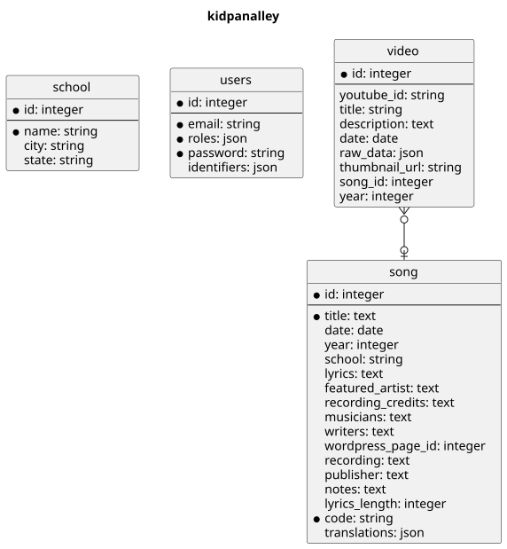
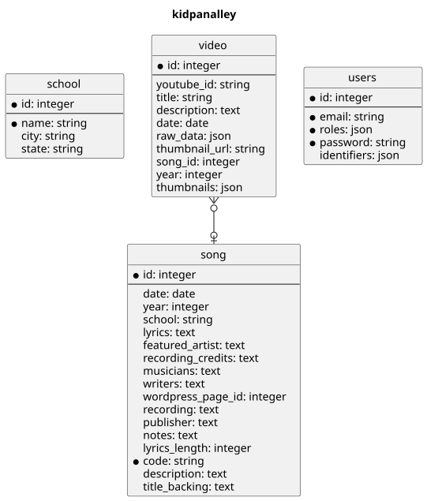

# # ~~

Archives for Kid Pan Alley


Also: https://github.com/kaimatt1/kid-pan


## Installation

```bash
git clone git@github.com:tacman/kpa kpa && cd kpa
echo "DATABASE_URL=sqlite:///%kernel.project_dir%/var/data.db" > .env.local
echo "DATABASE_URL=sqlite:///%kernel.project_dir%/var/data_test.db" > .env.test
composer install
bin/console doctrine:schema:update --force
symfony server:start -d
symfony open:local
```

```bash
curl -k -s 'https://127.0.0.1:8010//meili/meiliAdmin/meili/indexes/kpa_song/search' \
  -H 'Content-Type: application/json' \
  --data-raw '{
    "q":"gratitude",
    "hybrid":{"embedder":"small","semanticRatio":0.3}
  }' | jq '{estimatedTotalHits, hitsCount: (.hits|length)}'

```


## Running tests

```bash
bin/console doctrine:schema:update --force --env=test
bin/console doctrine:fixtures:load -n --env=test
vendor/bin/phpunit
```

## Search + Lyrics Indexing

Use these commands when Song search results are stale, missing lyrics, or sorting/filtering fields changed.

```bash
# 1) (Optional) reset Song index settings/documents if the index is in a bad state
bin/console meili:settings:update song --force --wait --reset

# 2) Re-apply Song index settings (filterable/sortable/searchable fields)
bin/console meili:settings:update song --force --wait

# 3) Repopulate Song documents into Meili
bin/console meili:populate song --sync --wait

# 4) Sync local index metadata table (index_info)
bin/console meili:registry:sync
```

Lyrics ingestion (DB-first):

```bash
# Build SongLyrics links from already-extracted FileAsset.lyricsCandidates
bin/console app:link-lyrics

# One-time backfill from legacy JSONL extraction file
bin/console app:ingest-lyrics-jsonl data/lyrics.jsonl
```

Quick verification:

```bash
bin/console dbal:run-sql "SELECT COUNT(*) AS songs_with_lyrics FROM song WHERE lyrics IS NOT NULL AND lyrics <> ''"
bin/console dbal:run-sql "SELECT index_name, document_count FROM index_info WHERE index_name='kpa_song'"
```

If browser templates throw `Twig function path is not configured`, ensure JS-Twig support is installed and routes are generated:

```bash
composer require survos/js-twig-bundle
bin/console cache:clear
```


    usage here.

## Database




## MusicXML

nice progression from simple
https://www.music-for-music-teachers.com/twinkle-twinkle.html


## Setup

install csvkit (sudo apt install csvkit)
convert the excel files to csv (in2csv kpa-songs.xlsx > songs.csv)
so we don't need spreadsheet kit.


```bash
git clone git@github.com:survos/kidpanalley.git kpa && cd kpa
git checkout tac
composer install
./c grid:index --reset


bin/console d:d:drop --force
bin/console d:d:create
bin/console doctrine:schema:update --force --complete
bin/console app:load-data
bin/console grid:index
symfony server:start -d
symfony open:local --path=/song
```

## Testing

```bash
bin/console d:sch:update --force --env=test
APP_ENV=test bin/create-admins.sh
bin/console app:load --songs --video --env=test

bin/console survos:crawl --env=test
bin/console survos:crawl:smoke
bin/console survos:make:crawl-tests

vendor/bin/phpunit tests
@todo: add survos_commands to survos_crawler.yaml ignore
```
Tools for KPA

Load the exists assets (youtube and songs) via

```bash
bin/console app:load-data
```

Database Tables

* Videos: from youtube now, eventually from Dropbox too.
* Photos: Eventually from Dropbox
* Schools: residencies
* Songs: 5K from the spreadsheet.  Talented Clementine and Best Friends _could_ be added.
* User: for permissions

## Other projects

// https://www.youtube.com/watch?v=NeRjdX06_n8&t=186s if it were a generalized video / transcript research site


*build with survos/doc-bundle*

## Ideas

use ChordPro as canonical format

* https://github.com/pathawks/Christmas-Songs
* https://github.com/joeycortez42/worship/tree/master/songs
* https://github.com/mattgraham/worship (OnSong format)

Move to huggingface?
