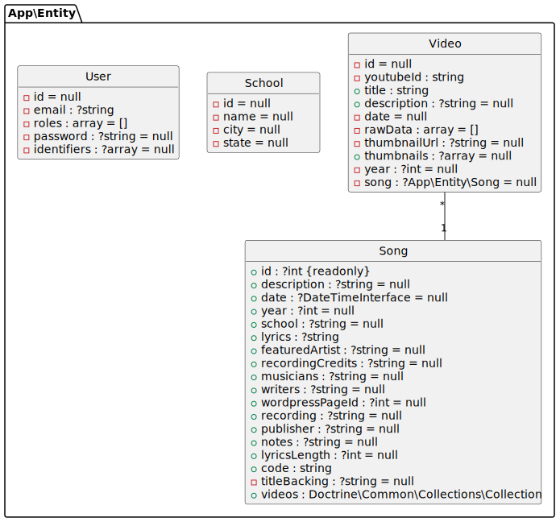

# # ~~

Archives for Kid Pan Alley


## Installation

```bash
git clone git@github.com:tacman/kpa kpa && cd kpa
echo "DATABASE_URL=sqlite:///%kernel.project_dir%/var/data.db" > .env.local
echo "DATABASE_URL=sqlite:///%kernel.project_dir%/var/data_test.db" > .env.test
composer install
bin/console doctrine:schema:update --force
symfony server:start -d
symfony open:local
```


## Running tests

```bash
bin/console doctrine:schema:update --force --env=test
bin/console doctrine:fixtures:load -n --env=test
vendor/bin/phpunit
```


    usage here.

## Database




## Setup

install csvkit (sudo apt install csvkit)
convert the excel files to csv (in2csv kpa-songs.xlsx > songs.csv)
so we don't need spreadsheet kit.


```bash
git clone git@github.com:survos/kidpanalley.git kpa && cd kpa
git checkout tac
composer install
./c grid:index --reset


bin/console d:d:drop --force
bin/console d:d:create
bin/console doctrine:schema:update --force --complete
bin/console app:load-data
bin/console grid:index
symfony server:start -d
symfony open:local --path=/song
```


Tools for KPA

Load the exists assets (youtube and songs) via

```bash
bin/console app:load-data
```

Database Tables

* Videos: from youtube now, eventually from Dropbox too.
* Photos: Eventually from Dropbox
* Schools: residencies
* Songs: 5K from the spreadsheet.  Talented Clementine and Best Friends _could_ be added.
* User: for permissions

## Other projects

// https://www.youtube.com/watch?v=NeRjdX06_n8&t=186s if it were a generalized video / transcript research site


*build with survos/doc-bundle*
